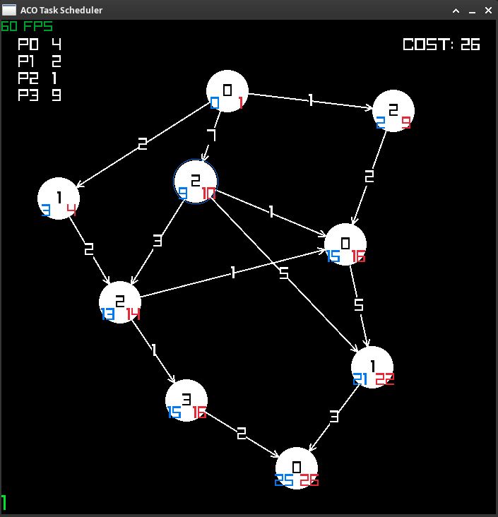

# Description

This is a project that implements the paper:

Jeffrey Elcock and Niekiesha Edward. An efficient ACO-based algorithm for task scheduling in heterogeneous multiprocessing environment.

In short, the problem is that in multiprocessing environment, different processors may process different tasks at varying speeds. In addition, some tasks may depend on other tasks to complete before running. Scheduling tasks to processes in such a setup is an NP-hard problem. A solution proposed by the above paper is to use Ant Colony Optimization to find an approximate solution in an appropriate amount of time.

# Run

Either download the executable in Release or build it with the instructions below. Note that you will require Raylib.

# Build

Requires Raylib library


```bash

mkdir build
cd build
cmake ..
make
./ACOTaskScheduler

```



